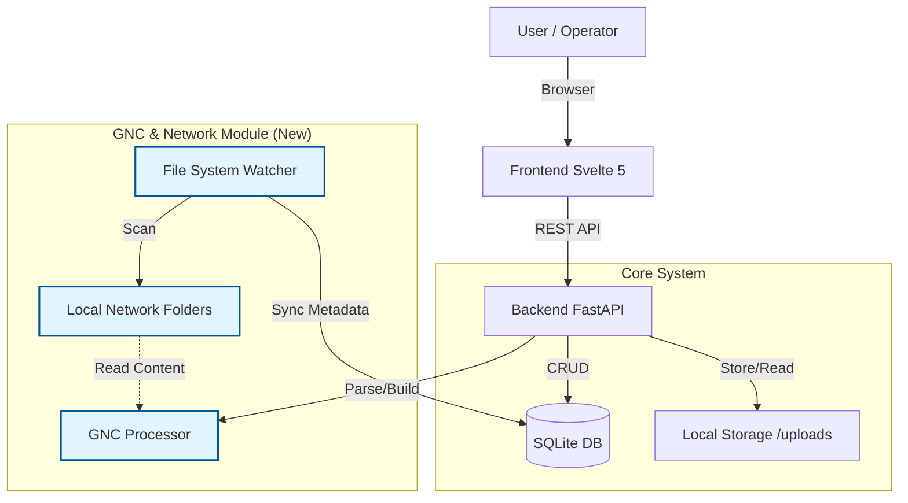

# Application Architecture

## 1. Current Architecture
The current system acts as a centralized Document Tracker with embedded Task management and OCR capabilities.

### 1.1 Core Components
*   **Frontend (Svelte 5 + Vite):**
    *   Single Page Application (SPA).
    *   Responsive "Card-based" UI for Documents.
    *   Embedded Task Lists and Journal Entries within Document cards.
    *   Communicates via REST API.
*   **Backend (FastAPI + Python 3.12):**
    *   **Monolithic API**: Handles all business logic for Documents, Tasks, Tags, and Settings.
    *   **Database**: SQLite (via SQLAlchemy) for persistence.
    *   **File Storage**: Local filesystem (`static/uploads`) for attachments.
    *   **Distribution**: Bundled as a single executable via PyInstaller.

### 1.2 Data Flow
1.  User creates/updates Document -> Frontend calls API -> Backend updates DB.
2.  User uploads file -> Backend saves to disk -> Creates Attachment record.
3.  **Local Sync**: Backend scans configured folders -> Updates DB -> Links GNC files.

---

## 2. Planned Architecture Changes
The system is evolving to support **Manufacturing Visualization (GNC)** and **Local Network Integration**.

### 2.1 New Modules

#### A. GNC Editor Module (Stage 1 & 2)
*   **Purpose**: Visualize and edit CNC programs (.GNC files).
*   **Components**:
    *   **Frontend**: New `GncCanvas` component using HTML5 Canvas API for high-performance rendering of geometry.
    *   **Backend**: `GNCProcessor` class to parse G-code text into structured JSON (Sheet, Contours, Commands).
*   **Integration**:
    *   GNC files will be treated as specialized Attachments.
    *   Parsed data (P-codes, Geometry) will be linked to `Part` entities.

#### B. File System Watcher / Importer (Stage 2.5)
*   **Purpose**: Sync "Mihtav" and "Sidra" folders from the local network.
*   **Mechanism**:
    *   **Scanner**: A background task or scheduled job in FastAPI.
    *   **Logic**:
        *   Scans configured paths for "Mihtav" (Order) and "Sidra" (Series) folders.
        *   Parses GNC files to extract: Material, Parts List, Timestamps.
        *   Creates/Updates `Document` records (Type: Order) based on folder names.
        *   Links parsed GNC files as attachments to these Documents.
*   **Folder Mapping**:
    *   Users will configure which network paths map to which Document Types via the Settings UI.

### 2.2 Updated System Diagram

### 2.3 Data Model Extensions
*   **Part Entity**: Links specific GNC geometry to a Task.
    *   Fields: `registration_number`, `version_type` (A/B/C).
*   **Workspace Entity**: Represents a physical machine.
    *   Links: `User` <-> `Workspace`.
*   **Document**:
    *   New relationships to `GNCProgram` (or specialized Attachment metadata).

## 3. Migration Plan
1.  **Phase 1**: Implement GNC Parser and Canvas Visualizer (Standalone).
2.  **Phase 2**: Integrate GNC files into Document Attachments and Tasks.
3.  **Phase 3**: Implement File System Watcher to auto-populate Documents from Network Folders.
