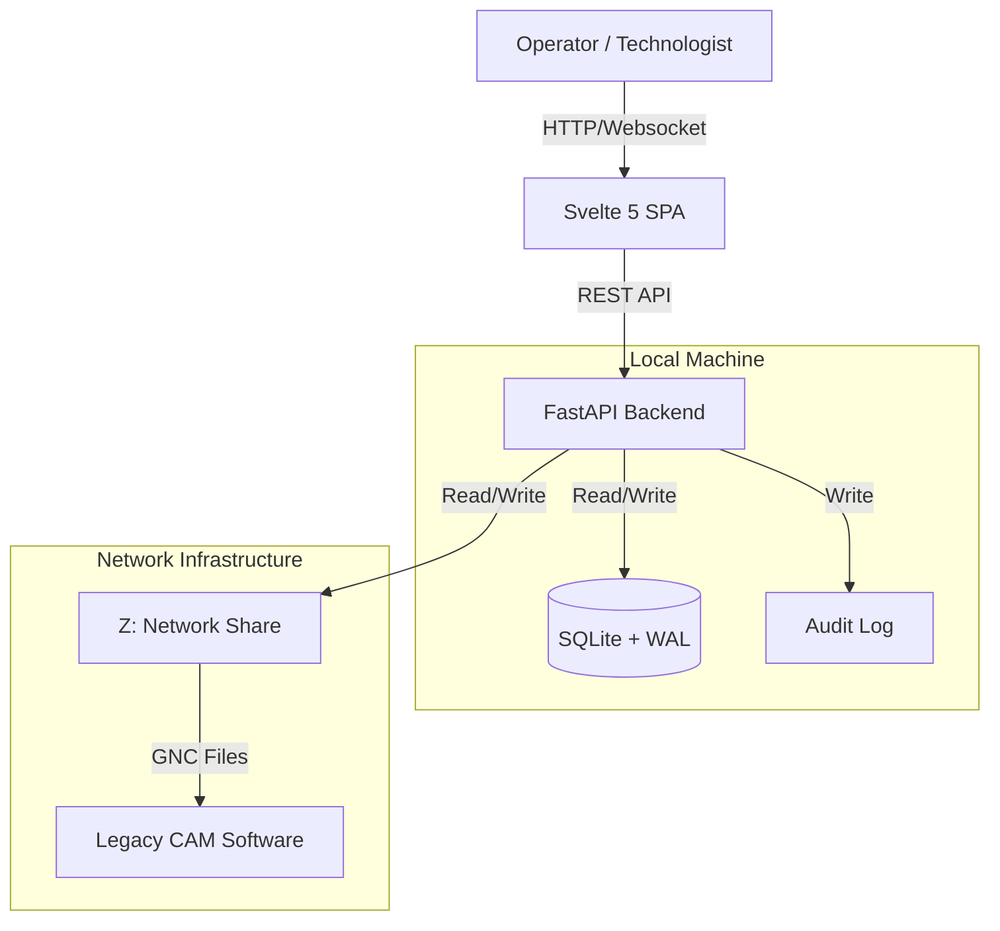

# DocuFlow Technical Reference

## Executive Summary
DocuFlow is a localized document management and manufacturing execution system (MES) designed for laser cutting shops. It bridges the gap between the office (technologists/engineers) and the manufacturing floor (operators) by synchonizing data from legacy network shares while providing a modern, real-time interface for tracking work orders ("Mihtav") and individual tasks ("Sidra").

Its primary goals are:
*   **Latency Elimination**: Replacing slow network file browsing with a local SQLite database.
*   **Traceability**: Logging every status change (Start, Stop, Resume, Finish) for production analytics.
*   **Inventory Control**: Managing raw material reservations to prevent stockouts.

## System Architecture

DocuFlow employs a **Local-First, Network-Synchronized** architecture. It is designed to run as a standalone executable on individual machines, each maintaining its own local database that synchronizes with a central network repository.

### Core Components

#### 1. Backend Service (Python/FastAPI)
The backend is the core orchestrator, responsible for:
*   **API Layer**: Exposing REST endpoints (`/documents`, `/tasks`, `/parts`) for the frontend.
*   **Sync Service** (`sync_service.py`): A background daemon that monitors the configured network paths (`mihtav`, `sidra`). It detects new folders/files, parses them, and updates the local SQLite database.
*   **GNC Parser** (`gnc_parser.py`): A proprietary regex-based engine that parses Rexroth/Hans Laser `*.801` G-code files to extract contours, gas types, and estimated cutting times.
*   **Warehouse Logic**: Handles complex inventory transactions, ensuring that material reservations are atomic and traced.

#### 2. Frontend Application (Svelte 5)
A modern Single Page Application (SPA) built with Svelte 5 and Vite.
*   **Reactive State**: Uses Svelte 5 runes (`$state`) for granular reactivity.
*   **Data Grid**: Implements AG Grid for high-performance rendering of thousands of document rows.
*   **GNC Viewer**: A custom Canvas-based vector renderer for previewing laser cutting nesting files directly in the browser.

#### 3. Data Storage (SQLite)
*   **WAL Mode**: The database runs in Write-Ahead Log mode to support higher concurrency, allowing the Sync Service to write updates while the API reads data for the UI.
*   **Schema**:
    *   `documents`: Represents the Work Order (physically a folder).
    *   `tasks`: Represents a specific nested file (physically a `.801` or `.gnc` file inside the document folder).
    *   `journal_entries`: An immutable append-only log of all actions performed on a document.

## Deployment Model

DocuFlow is deployed as a "frozen" single-folder application using **PyInstaller**. This ensures that no Python or Node.js runtime is required on the target machine.

### Build Process (`build_dist.py`)
1.  **Frontend Build**: Runs `npm run build` in `frontend/`, outputting assets to `frontend/dist`.
2.  **Asset Embedding**: The build script configures PyInstaller to embed `frontend/dist` as the `static` directory inside the executable's data bundle.
3.  **Backend Compilation**: FastApi and its dependencies are bundled into the executable.

### Installation
Deployments are simple file copies:
1.  Build the unified distributable (`python build_dist.py`).
2.  Copy the `dist/DocuFlow` folder to the target machine (e.g., `C:\Program Files\DocuFlow`).
3.  Run `main.exe` tasks.

## Configuration

Configuration is stored in the database (`settings` table) to allow dynamic updates without redeployment.
*   `mihtav_path`: UNC path to the Orders directory (e.g., `Z:\mihtav`).
*   `sidra_path`: UNC path to the Tasks directory.
*   `doc_name_regex`: Regex used to parse Order metadata from filenames.

## Development Setup

See [CONTRIBUTING.md](../CONTRIBUTING.md) for detailed setup instructions.
