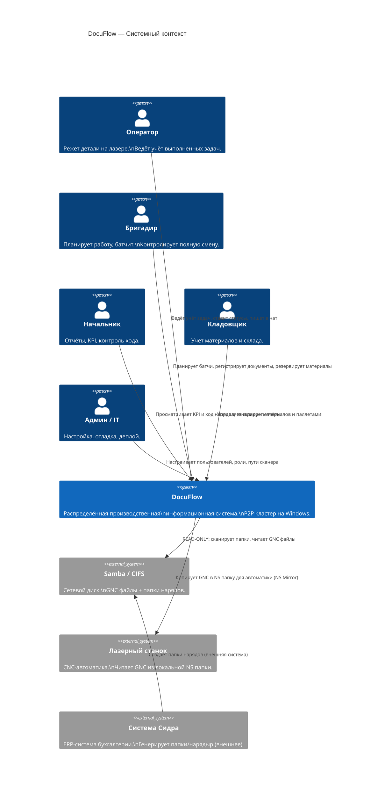
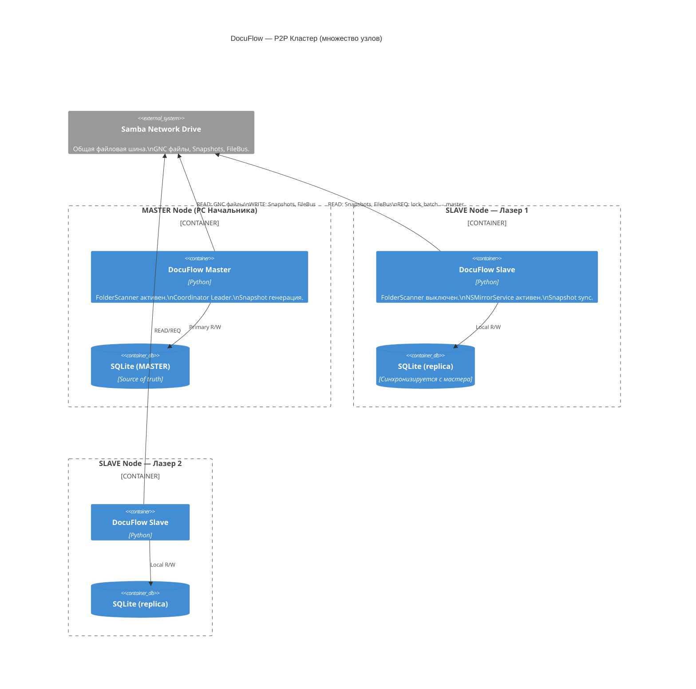
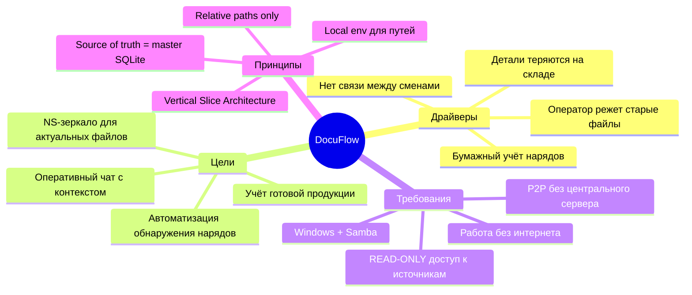
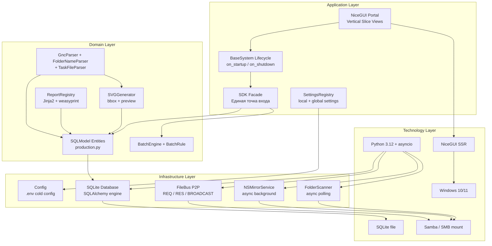
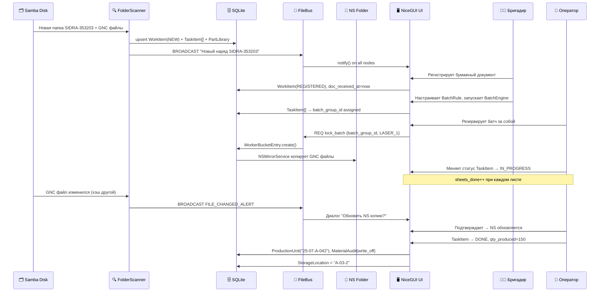

# DocuFlow — C4 & ArchiMate Diagrams

> **Версия:** 1.0
> Все диаграммы в Mermaid. Открываются в Obsidian / GitHub / любом Mermaid-рендерере.

---

## C4 Level 1 — System Context



---

## C4 Level 2 — Container Diagram

```mermaid
C4Container
  title DocuFlow — Контейнеры (один узел кластера)

  Person(user, "Пользователь", "Оператор / Бригадир / Начальник")

  System_Boundary(node, "DocuFlow Node (Windows PC / Laser)") {

    Container(nicegui, "NiceGUI Frontend",
              "Python NiceGUI (SSR)",
              "Веб-интерфейс через localhost.\nВертикальные срезы (feature views).\nАдаптируется под роль пользователя.")

    Container(app, "Application Core",
              "Python 3.12 / asyncio",
              "BaseSystem lifecycle.\nBusinessSystem per feature slice.\nSDK Facade (точка входа).\nSettingsRegistry.")

    Container(scanner, "FolderScanner",
              "async polling loop (master only)",
              "GncParser, FolderNameParser, TaskFileParser.\nSVGGenerator (bbox + preview).\nFileBus broadcast при изменении файлов.")

    Container(nsmirror, "NSMirrorService",
              "background task (all nodes)",
              "Зеркалит GNC из сети в локальную NS папку.\nСравнивает по MD5 (интервал 60s).\nАлерт оператору при изменении.")

    Container(filebus, "FileBus Client",
              "File-based P2P",
              "Читает/пишет REQ/RES/BROADCAST JSON\nна сетевой диск.\nSlave ↔ Master коммуникация.")

    ContainerDb(sqlite, "SQLite DB",
                "SQLite / SQLModel",
                "Единственная база данных узла.\nВсе доменные сущности.\nСинхронизируется через Snapshot.")
  }

  System_Ext(samba,  "Samba Network Drive", "GNC файлы, FileBus папки, Snapshots")
  System_Ext(ns,     "Local NS Folder",     "C:\\NS\\cutting — локальные GNC для станка")

  Rel(user,     nicegui,  "HTTPS / WebSocket (localhost)")
  Rel(nicegui,  app,      "Python calls")
  Rel(app,      sqlite,   "SQLModel ORM queries")
  Rel(app,      filebus,  "Commands / Responses")
  Rel(scanner,  samba,    "READ-ONLY: listdir + read GNC")
  Rel(scanner,  sqlite,   "Upsert WorkItem, TaskItem, PartLibrary")
  Rel(nsmirror, samba,    "Read GNC (compare MD5)")
  Rel(nsmirror, ns,       "Write/Delete GNC copies")
  Rel(filebus,  samba,    "Read/Write REQ_RES_BROADCAST JSON files")
```

---

## C4 Level 3 — FolderScanner Component

```mermaid
C4Component
  title FolderScanner — Компоненты

  Container_Boundary(fs_module, "features/folder_scanner") {

    Component(settings, "FolderScannerSettings",
              "BaseModuleSettings",
              "sidra_scan_path (local)\nmihtav_scan_path (local)\npoll_interval_seconds (local)\nenabled (global)")

    Component(scanner_loop, "FolderScanner",
              "async polling loop (master only)",
              "Итерирует папки по scan paths.\nВызывает парсеры.\nUpsert WorkItem + TaskItem.\nDelegates to Handlers.")

    Component(folder_parser, "FolderNameParser",
              "Pure function",
              "SIDRA regex + graceful fallback.\nВозвращает FolderMeta{type, sidra_num, step}.")

    Component(task_parser, "TaskFileParser",
              "Pure function",
              "is_variant() dedup.\nstep_index, batch_index из имени.\nФильтрует _AUT.TXT и .Dsp.")

    Component(gnc_parser, "GncParser",
              "Adapted from Old MVP",
              "Парсит *SHEET, Material, PART NAME.\nextract_sku(raw) → (sku, version).\nG-code контуры → contour/hole/corner count.\nestimate_time(mat_type) → минуты.")

    Component(svg_gen, "SVGGenerator",
              "Reused from Old MVP",
              "calculate_bounds(part) → (min_x,min_y,max_x,max_y).\ngenerate_thumbnail(part, path) → (w_mm, h_mm).\nПревью для PartLibrary.")

    Component(nsmirror_cmp, "NSMirrorService",
              "background asyncio task",
              "Мониторит WorkerBucket[this_node].\nКопирует GNC → NS папку.\nМD5 сравнение (60s интервал).")

    Component(view, "folder_scanner/view.py",
              "NiceGUI Vertical Slice",
              "Статус сканера.\nЛог последних событий.\nКнопка Scan Now (только мастер).")
  }

  ContainerDb(sqlite, "SQLite", "")
  System_Ext(samba, "Samba", "")
  System_Ext(ns, "NS Folder", "")

  Rel(scanner_loop, folder_parser, "parse folder name")
  Rel(scanner_loop, task_parser,   "filter + parse gnc filename")
  Rel(scanner_loop, gnc_parser,    "parse gnc content")
  Rel(gnc_parser,   svg_gen,       "generate bbox + svg preview")
  Rel(scanner_loop, sqlite,        "upsert entities")
  Rel(scanner_loop, samba,         "read-only scan")
  Rel(nsmirror_cmp, sqlite,        "read WorkerBucket")
  Rel(nsmirror_cmp, samba,         "read network GNC")
  Rel(nsmirror_cmp, ns,            "write local GNC")
  Rel(settings,     scanner_loop,  "provides paths + config")
```

---

## C4 Level 3 — Domain Entities Component

```mermaid
C4Component
  title Доменные сущности — Иерархия

  Container_Boundary(domain, "domain/entities/production.py") {

    Component(project,   "Project",   "SQLModel", "Контейнер: 'SHLAV-2' / 'Default'")
    Component(workitem,  "WorkItem",  "SQLModel", "Наряд/письмо/доработка.\nСтатусы: NEW→PENDING_CUTS→REGISTERED→IN_PROGRESS→DONE")
    Component(taskitem,  "TaskItem",  "SQLModel", "Один GNC файл.\nsheets_done, estimated/actual minutes.\nfile_hash для детекции изменений")
    Component(taskpart,  "TaskPart",  "SQLModel", "Деталь (SKU+qty) в TaskItem")
    Component(partlib,   "PartLibrary",  "SQLModel", "Справочник деталей.\nbbox_x/y из SVGGenerator")
    Component(parttempl, "PartTemplate", "SQLModel", "Шаблон предупреждения для детали")
    Component(mattype,   "MaterialType", "SQLModel", "cut_speed, pierce_time, idle_speed, tolerance%")
    Component(matstock,  "MaterialStock","SQLModel", "Физическая пачка на складе")
    Component(resv,      "Reservation",  "SQLModel", "Soft/Hard резерв материала")
    Component(mataudit,  "MaterialAudit","SQLModel", "Аудит движений материала")
    Component(produnit,  "ProductionUnit","SQLModel","Паллета. label_id='25-07-А-042'.\nSplit/merge поддержка")
    Component(storloc,   "StorageLocation","SQLModel","Стеллаж / место 'A-02-3'")
    Component(bucket,    "WorkerBucketEntry","SQLModel","Корзина оператора. Handover поддержка.")
    Component(worklog,   "WorkLog",     "SQLModel", "Полный аудит всех событий")
    Component(incident,  "IncidentLog", "SQLModel", "Инциденты + вложения")
    Component(chat,      "ChatMessage", "SQLModel", "Чат. Дерево ответов. Типы: MSG/ORDER/INCIDENT")
    Component(tag,       "Tag",         "SQLModel", "Теги для проектов/нарядов/тасков")
    Component(report,    "ReportTemplate","SQLModel","Jinja2 HTML шаблон отчёта")
    Component(viewpreset,"ViewPreset",  "SQLModel", "Notion-подобный пресет вида")
    Component(notiftempl,"NotificationTemplate","SQLModel","Настраиваемые тексты уведомлений")
    Component(consumable,"Consumable",  "SQLModel", "Расходники: сопла, линзы, лента")
    Component(conslog,   "ConsumableLog","SQLModel","Движения расходников")
  }

  Rel(project,  workitem,  "1 → *")
  Rel(workitem, taskitem,  "1 → *")
  Rel(taskitem, taskpart,  "1 → *")
  Rel(taskpart, partlib,   "* → 1")
  Rel(partlib,  parttempl, "1 → *")
  Rel(mattype,  matstock,  "1 → *")
  Rel(matstock, resv,      "1 → *")
  Rel(matstock, mataudit,  "1 → *")
  Rel(taskitem, produnit,  "1 → *")
  Rel(produnit, storloc,   "* → 1")
  Rel(taskitem, bucket,    "1 → *")
  Rel(workitem, worklog,   "1 → *")
  Rel(taskitem, worklog,   "1 → *")
  Rel(taskitem, incident,  "? → *")
  Rel(workitem, chat,      "1 → *")
  Rel(chat,     chat,      "parent → child (дерево)")
```



---

## C4 Level 2 — P2P Cluster (Multi-Node)



---

## ArchiMate — Мотивационный аспект



---

## ArchiMate — Технологический уровень



---

## ArchiMate — Бизнес-процессы (Operational Cycle)


