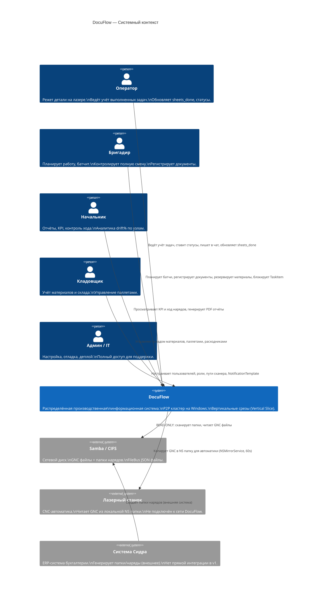
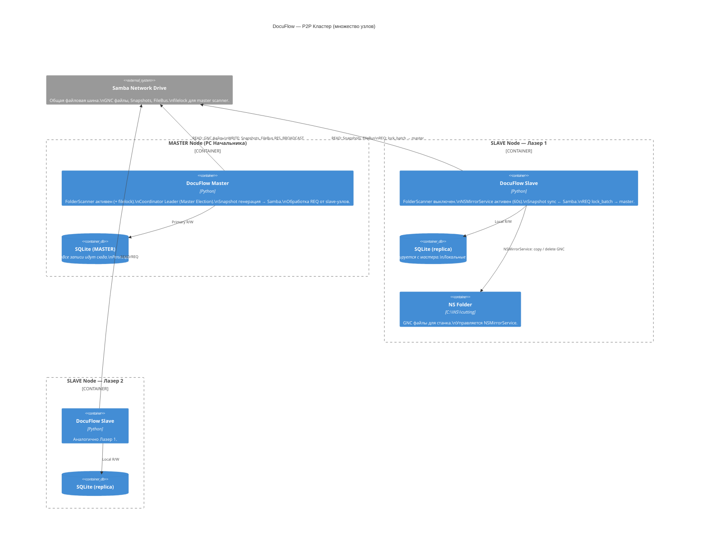
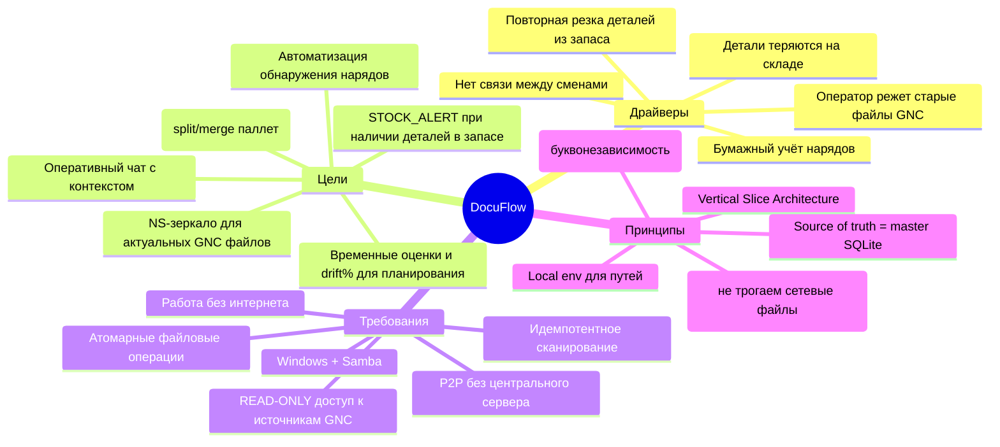
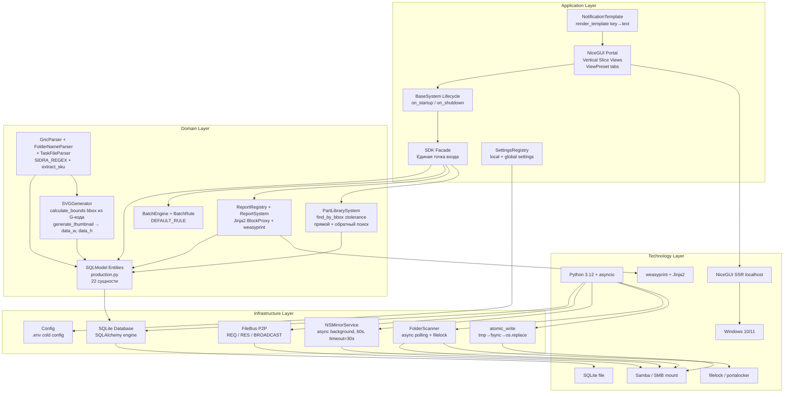
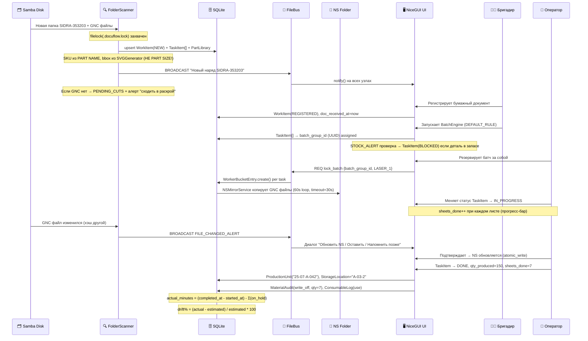

# DocuFlow — C4 & ArchiMate Diagrams

> **Версия:** 2.0 (на основе Master Plan v7)
> Все диаграммы в Mermaid. Открываются в Obsidian / GitHub / любом Mermaid-рендерере.

---

## C4 Level 1 — System Context



---

## C4 Level 2 — Container Diagram

```mermaid
C4Container
  title DocuFlow — Контейнеры (один узел кластера)

  Person(user, "Пользователь", "Оператор / Бригадир / Начальник")

  System_Boundary(node, "DocuFlow Node (Windows PC / Laser)") {

    Container(nicegui, "NiceGUI Frontend",
              "Python NiceGUI (SSR)",
              "Веб-интерфейс через localhost.\nВертикальные срезы (feature views).\nАдаптируется под роль пользователя.\nViewPreset (Notion-like tabs).")

    Container(app, "Application Core",
              "Python 3.12 / asyncio",
              "BaseSystem lifecycle.\nBusinessSystem per feature slice.\nSDK Facade (точка входа).\nSettingsRegistry (local + global).\nReportSystem (Jinja2 + weasyprint).")

    Container(scanner, "FolderScanner",
              "async polling loop (master only)",
              "GncParser, FolderNameParser, TaskFileParser.\nSVGGenerator (bbox из G-кода, не PART SIZE!).\nfilelock защита от параллельного запуска.\nFileBus broadcast при изменении файлов.\nИдемпотентный upsert по file_path.")

    Container(nsmirror, "NSMirrorService",
              "background task (all nodes)",
              "Зеркалит GNC из сети в локальную NS папку.\nСравнивает по MD5 (интервал 60s, timeout 30s).\nАлерт оператору при изменении.\nДиалог: Обновить / Оставить / Напомнить.")

    Container(filebus, "FileBus Client",
              "File-based P2P",
              "Читает/пишет REQ/RES/BROADCAST JSON\nна сетевой диск.\nSlave ↔ Master коммуникация.\nКоманды: lock_batch, file_changed, snapshot_sync.")

    ContainerDb(sqlite, "SQLite DB",
                "SQLite / SQLModel",
                "Единственная база данных узла.\nВсе доменные сущности.\nСинхронизируется через Snapshot.")
  }

  System_Ext(samba,  "Samba Network Drive", "GNC файлы, FileBus папки, Snapshots")
  System_Ext(ns,     "Local NS Folder",     "C:\\NS\\cutting — локальные GNC для станка")
  System_Ext(lock,   ".docuflow.lock",      "filelock на scan_root — защита сканера")

  Rel(user,     nicegui,  "HTTPS / WebSocket (localhost)")
  Rel(nicegui,  app,      "Python calls")
  Rel(app,      sqlite,   "SQLModel ORM queries")
  Rel(app,      filebus,  "Commands / Responses")
  Rel(scanner,  samba,    "READ-ONLY: listdir + read GNC")
  Rel(scanner,  lock,     "Acquire filelock перед сканированием")
  Rel(scanner,  sqlite,   "Upsert WorkItem, TaskItem, PartLibrary (идемпотентно)")
  Rel(nsmirror, samba,    "Read GNC (compare MD5)")
  Rel(nsmirror, ns,       "Write/Delete GNC copies (atomic copy)")
  Rel(filebus,  samba,    "Read/Write REQ_RES_BROADCAST JSON files")
```

---

## C4 Level 3 — FolderScanner Component

```mermaid
C4Component
  title FolderScanner — Компоненты

  Container_Boundary(fs_module, "features/folder_scanner") {

    Component(settings, "FolderScannerSettings",
              "BaseModuleSettings",
              "sidra/mihtav/other_scan_path (local)\nlocal_ns_path (local)\npoll_interval_seconds (local)\nns_mirror_interval_seconds (local)\nns_mirror_copy_timeout_s (local)\nenabled, default_project_name (global)")

    Component(scanner_loop, "FolderScanner",
              "async polling loop (master only)",
              "Итерирует папки по scan paths.\nfilelock защита от параллельного запуска.\nUpsert WorkItem + TaskItem (идемпотентно).\nPENDING_CUTS если нет GNC файлов.\nDelegates to Handlers.")

    Component(folder_parser, "FolderNameParser",
              "Pure function",
              "SIDRA_REGEX: ^SIDRA-(number)-(step)-(date)$\ngraceful fallback → MIHTAV + Default project.\nВозвращает FolderMeta{type, sidra_num, sidra_step}.")

    Component(task_parser, "TaskFileParser",
              "Pure function",
              "is_variant() dedup (фильтр дублей-вариантов).\nstep_index, batch_index из имени файла.\nФильтрует _AUT.TXT и .Dsp (ненадёжные).")

    Component(gnc_parser, "GncParser",
              "Adapted from Old MVP",
              "Парсит *SHEET → sheet_x/y/qty/thickness.\nМатериал из (Material:...) строки.\nPART NAME → extract_sku(raw):\n  last alpha segment = version_letter\n  last digit segment = version_suffix (TBD)\nG-code контуры → contour/hole/corner count.\nestimate_time(mat_type) → минуты.")

    Component(svg_gen, "SVGGenerator",
              "Reused from Old MVP",
              "calculate_bounds(part) → (min_x,min_y,max_x,max_y).\ngenerate_thumbnail(part, path) → (data_w, data_h).\ndata_w/data_h = реальный bbox детали из G-кода.\nНЕ использовать PART SIZE (это bbox нестa)!\nПревью SVG для PartLibrary.")

    Component(nsmirror_cmp, "NSMirrorService",
              "background asyncio task (all nodes)",
              "Мониторит WorkerBucket[this_node].\nКопирует GNC → NS папку (timeout=30s).\nМD5 сравнение (60s интервал).\nДиалог: Обновить / Оставить / Напомнить позже.\nУдаляет при выходе из bucket.")

    Component(view, "folder_scanner/view.py",
              "NiceGUI Vertical Slice",
              "Статус сканера (мастер/слейв).\nЛог последних событий (scan_log_panel).\nКнопка Scan Now (только мастер).\nNS Mirror status индикатор.")
  }

  ContainerDb(sqlite, "SQLite", "")
  System_Ext(samba, "Samba", "")
  System_Ext(ns, "NS Folder", "")
  System_Ext(lock, ".docuflow.lock", "")

  Rel(scanner_loop, settings,     "reads paths + config")
  Rel(scanner_loop, folder_parser, "parse folder name → FolderMeta")
  Rel(scanner_loop, task_parser,   "filter + parse gnc filename")
  Rel(scanner_loop, gnc_parser,    "parse gnc content")
  Rel(gnc_parser,   svg_gen,       "generate bbox (data_w, data_h) + svg preview")
  Rel(scanner_loop, sqlite,        "upsert WorkItem / TaskItem / PartLibrary (идемпотентно)")
  Rel(scanner_loop, samba,         "read-only scan")
  Rel(scanner_loop, lock,          "acquire filelock before scan")
  Rel(nsmirror_cmp, sqlite,        "read WorkerBucket[this_node]")
  Rel(nsmirror_cmp, samba,         "read network GNC (compare MD5)")
  Rel(nsmirror_cmp, ns,            "write / delete local GNC")
```

---

## C4 Level 3 — Domain Entities Component

```mermaid
C4Component
  title Доменные сущности — Иерархия

  Container_Boundary(domain, "domain/entities/production.py") {

    Component(project,   "Project",   "SQLModel", "Контейнер: 'SHLAV-2' / 'Default'.\nis_default=True для одного проекта.")
    Component(workitem,  "WorkItem",  "SQLModel", "Наряд/письмо/доработка.\nСтатусы: NEW/PENDING_CUTS/FOLDER_NO_DOC/\nDOC_NO_FOLDER/REGISTERED/IN_PROGRESS/\nON_HOLD/BLOCKED/DONE/CANCELLED/ARCHIVED.\nfolder_found_at, doc_received_at.")
    Component(taskitem,  "TaskItem",  "SQLModel", "Один GNC файл.\nsheets_done, estimated/actual minutes.\nfile_hash MD5 для детекции изменений.\nblock_reason если BLOCKED.\ndrift% = (actual-estimated)/estimated.")
    Component(taskpart,  "TaskPart",  "SQLModel", "Деталь (SKU + version + version_suffix + qty).\nversion_suffix сохраняется, назначение TBD.")
    Component(partlib,   "PartLibrary",  "SQLModel", "Справочник деталей.\nbbox_x/y из SVGGenerator (НЕ PART SIZE!).\ncontour_count, hole_count, corner_count.")
    Component(parttempl, "PartTemplate", "SQLModel", "Шаблон предупреждения.\nseverity: info|warning|critical.\nПоказывается оператору при открытии TaskItem.")
    Component(mattype,   "MaterialType", "SQLModel", "cut_speed_mm_per_min, pierce_time_sec,\nidle_speed_mm_per_min, time_tolerance_pct.\nРедактируется бригадиром для корректировки drift.")
    Component(matstock,  "MaterialStock","SQLModel", "Физическая пачка на складе.\nstatus: AVAILABLE/RESERVED/ALLOCATED/CONSUMED/DEFECT.")
    Component(resv,      "Reservation",  "SQLModel", "Soft/Hard резерв материала под WorkItem.")
    Component(mataudit,  "MaterialAudit","SQLModel", "Аудит движений: income/write_off/correction/defect/reorder.\nqty_delta + qty_kg_delta (параллельный учёт).")
    Component(consumable,"Consumable",   "SQLModel", "Расходник: сопла, линзы, лента, газ.\nmin_quantity → алерт при критическом остатке.")
    Component(conslog,   "ConsumableLog","SQLModel", "Движения расходников: use/restock/write_off.")
    Component(produnit,  "ProductionUnit","SQLModel","Паллета. label_id='25-07-А-042'.\nSplit → parent_label_id, is_pre_system.\nMerge → архивирует оба источника.")
    Component(storloc,   "StorageLocation","SQLModel","Стеллаж / место 'A-02-3'.")
    Component(bucket,    "WorkerBucketEntry","SQLModel","Корзина оператора. batch_group_id (UUID).\nHandover: note, from, at.")
    Component(worklog,   "WorkLog",     "SQLModel", "Полный аудит: INFO/WARNING/FILE_CHANGED/\nSTATUS_CHANGE/ON_HOLD/HANDOVER/STOCK_ALERT/\nSCAN_ERROR/BLOCKED/EMPTY_FOLDER/NS_MIRROR.")
    Component(incident,  "IncidentLog", "SQLModel", "Инциденты: laser_failure/part_defect/\nmaterial_defect/waiting_crane/other.\nresolved, resolved_by, resolved_at.\nattachments (JSON paths).")
    Component(chat,      "ChatMessage", "SQLModel", "Чат. Дерево ответов (parent_message_id).\nТипы: MESSAGE/INFO/WARNING/URGENT/\nORDER/INCIDENT/HANDOVER/REPORT.\nattachments (JSON paths).")
    Component(tag,       "Tag",         "SQLModel", "Теги для проектов/нарядов/тасков.")
    Component(report,    "ReportTemplate","SQLModel","Jinja2 HTML шаблон отчёта.")
    Component(viewpreset,"ViewPreset",  "SQLModel", "Notion-подобный пресет вида.\nowner: username | 'global'.\nview_type: table|kanban|list|cards.")
    Component(notiftempl,"NotificationTemplate","SQLModel","Настраиваемые тексты уведомлений.\nkey → text с {переменными}.\nCRUD через Admin Panel.")
  }

  Rel(project,  workitem,  "1 → *")
  Rel(workitem, taskitem,  "1 → *")
  Rel(taskitem, taskpart,  "1 → *")
  Rel(taskpart, partlib,   "* → 1 (part_sku FK)")
  Rel(partlib,  parttempl, "1 → *")
  Rel(mattype,  matstock,  "1 → *")
  Rel(matstock, resv,      "1 → *")
  Rel(matstock, mataudit,  "1 → *")
  Rel(taskitem, produnit,  "1 → * (task_item_id nullable)")
  Rel(produnit, storloc,   "* → 1")
  Rel(taskitem, bucket,    "1 → *")
  Rel(workitem, worklog,   "1 → *")
  Rel(taskitem, worklog,   "1 → *")
  Rel(taskitem, incident,  "? → *")
  Rel(workitem, incident,  "? → *")
  Rel(workitem, chat,      "? → *")
  Rel(chat,     chat,      "parent → child (дерево)")
  Rel(consumable, conslog, "1 → *")
```



---

## C4 Level 2 — P2P Cluster (Multi-Node)



---

## ArchiMate — Мотивационный аспект



---

## ArchiMate — Технологический уровень



---

## ArchiMate — Бизнес-процессы (Operational Cycle)



---

## ArchiMate — Поиск деталей (прямой и обратный)

```mermaid
flowchart LR
  A[Пользователь вводит SKU\n3433-11-004-G] --> B{Тип поиска}

  B -->|Прямой| C[Деталь в конкретном наряде?]
  C --> D[TaskPart.part_sku]
  D --> E[TaskItem]
  E --> F[WorkItem\nSIDRA-353203]

  B -->|Обратный| G[Где встречается деталь?]
  G --> H[TaskPart[] all]
  H --> I[TaskItem[] all]
  I --> J[WorkItem[] + Project[]]
  I --> K[ProductionUnit[]]
  K --> L[StorageLocation\nA-02-3]

  B -->|По геометрии| M[bbox ± tolerance\nhole_count\ncorner_count]
  M --> N[PartLibrary[]\nпохожие детали]

  style L fill:#90EE90
  style F fill:#87CEEB
  style N fill:#FFD700
```
